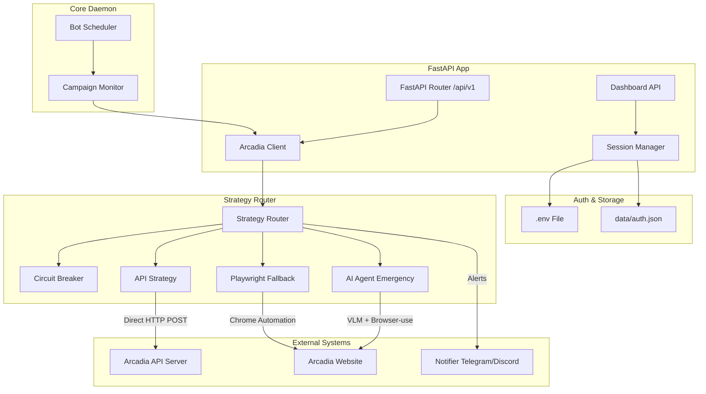

# 🏗️ Arcadia Slot Bot — High-Level Architectural Design

This document outlines the architectural design, implementation details, design choices, trade-offs, and future scaling recommendations for the Arcadia Slot Bot.

---

## 1. System Overview & Implemented Architecture

The bot is designed to automate the detection and locking of campaign slots on the Arcadia platform. It operates as an asynchronous daemon integrated with a FastAPI web dashboard and API.

### Component Diagram

### Key Modules Implemented

1. **Strategy Pattern (`StrategyRouter`)**: Decouples the business logic of slot locking from the execution method. It attempts locks using strategies in priority order:
   * **API Strategy (Primary)**: Direct HTTP requests (`POST /api/clip/campaigns/{id}/lock`). Execution speed is **sub-50ms**.
   * **Playwright Strategy (Fallback)**: Simulates a real browser to lock slots, serving as a fallback if the API endpoint structure changes. Execution speed is **2–4s**.
   * **AI Agent Strategy (Emergency)**: Uses a Vision-Language Model (VLM) via `browser-use` to dynamically navigate pages. Extremely resilient but slow (**10–30s**).
2. **Circuit Breaker (`CircuitBreaker`)**: Monitors the failure rates of each strategy. If a strategy fails consecutively (e.g. cookie expires causing 401s in the API strategy), the circuit opens, preventing the bot from wasting critical milliseconds on that strategy and falling back immediately.
3. **Session Lifecycle Manager (`SessionManager`)**: Manages Next-Auth cookie sessions, handling decryption, injection, and updates.
4. **Rolling Session Refresh**: Next-Auth cookies expire after inactivity. The bot dynamically intercepts `Set-Cookie` headers from all responses. Every 60 seconds, a warmup job polls `/api/auth/session` to trigger a session extension on the server, saving the refreshed cookie back to the `.env` file and Playwright storage state.
5. **Campaign Monitor & Scheduler**: Runs the polling loop with dynamic scaling:
   * **Default**: 10s poll interval.
   * **Release Window**: Polls every 3s when campaigns approach their closing dates or slot releases.
   * **Active Full**: Polls every 5s if active campaigns are currently full but might drop slots.

---

## 2. Design Choices & Rationale

* **Asynchronous Execution (`asyncio` / `aiohttp` / `playwright.async_api`)**: In high-frequency slot-locking races, blocking I/O is unacceptable. The entire application uses Python's `asyncio` loop. This allows the bot to fetch campaign lists and attempt locks on multiple campaigns concurrently in parallel threads using `asyncio.gather`.
* **API-First with Browser Fallbacks**: The API strategy targets direct endpoints to win the speed race. However, web scrapers and direct API clients are fragile when backend endpoints change. Having Playwright and VLM fallbacks ensures the bot continues functioning (albeit slower) while developers update the API selectors.
* **In-Memory State with File Persistence**: The bot stores session states and circuit breaker metrics in memory for instant access, but serializes updated session cookies back to the `.env` file and `data/auth.json` to ensure the bot can recover gracefully from crash/restarts.

---

## 3. Trade-offs

| Design Choice | Pros | Cons |
| :--- | :--- | :--- |
| **Active Polling** | Simple to implement; does not require exposing webhook endpoints. | Introduces a latency gap (up to the poll interval). Polling too fast risks IP bans/rate limits. |
| **Combined Daemon & Web Server** | Easy to deploy as a single container. | Playwright browser instances are CPU/memory heavy. Launching them can block or slow down API responses on the FastAPI server. |
| **Single-User Architecture** | Simplified token and configuration management. | Cannot scale easily to manage slots for multiple clippers/accounts. |

---

## 4. Recommendations for Scale, Efficiency, & Reliability

To scale this bot to manage hundreds of accounts, compete in microsecond-level release windows, and achieve 99.9% uptime, the following architectural upgrades are recommended:

### A. Distributed Architecture (Decoupled Services)
Instead of running the web server, scheduler, and Playwright browsers in a single process, split them into microservices:
1. **Producer (Campaign Monitor)**: A lightweight daemon focused solely on high-speed polling.
2. **Message Broker (RabbitMQ / Redis PubSub)**: Broadcasts campaign drop events.
3. **Consumer Pool (Locking Workers)**: Scalable worker instances (Celery / RQ) that execute lock tasks. Playwright browser executions are isolated here, preventing them from impacting the main monitoring loop's resources.

### B. Pre-Warmed Headless Browser Pool
Currently, launching Chromium on a Playwright fallback takes **2–4 seconds**, which guarantees losing the slot. 
* **Improvement**: Maintain a pool of pre-warmed, pre-authenticated headless browser tabs running in the background. When a fallback lock is triggered, the worker simply grabs an active page context from the pool, reducing the UI interaction time to **<300ms**.

### C. Webhook/Event-Driven Push (If Supported)
Polling is inherently inefficient. If the target platform supports WebSockets, Server-Sent Events (SSE), or Webhooks, migrate the bot to a push listener. This cuts latency from up to `10s` down to `<10ms` from the moment the server registers the campaign.

### D. Proxy Rotation & Anti-Fingerprinting
Competitors or Cloudflare/AWS WAF might rate-limit or block the bot's server IP.
* Integrate a proxy middleware pool (e.g. Bright Data, Oxylabs) to rotate IPs on every request.
* Utilize advanced anti-fingerprinting libraries (like `puppeteer-extra-plugin-stealth` equivalents) to mask browser headers, Canvas fingerprinting, and TLS Client Hello signatures.
